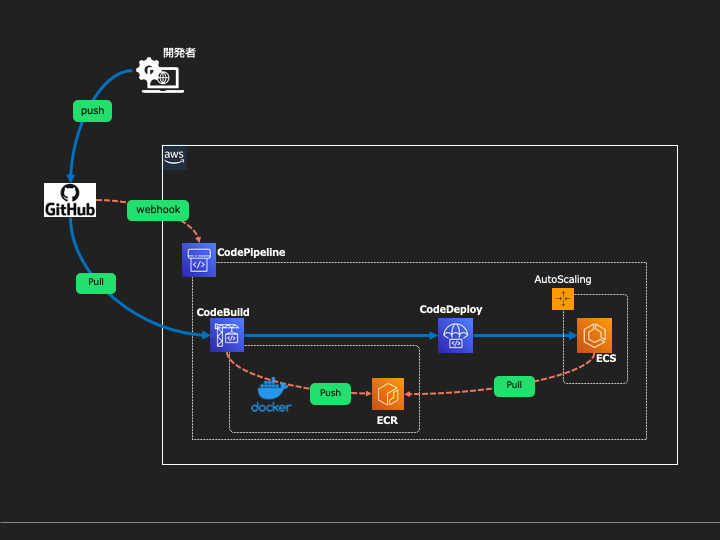

# CloudFormationでSpringBoot雛形アプリをECSにBlue/Greenデプロイする環境を構築する手順

- AWSリソースの設定値はひとまず動かすことだけにフォーカスしたものなので、そのまま商用環境で利用しないこと
- Auroraデータベースは構築しなくてもアプリが動作するようになっているため必要に応じて構築する

## 構成図


## 事前準備

### AWS Codestar Connectionsの接続作成
GitHubからソースコードを取得するための接続を以下より作成  
https://ap-northeast-1.console.aws.amazon.com/codesuite/settings/connections/create?origin=settings&region=ap-northeast-1

### AWS SystemsManagerのパラメータストアで以下の値を登録
https://ap-northeast-1.console.aws.amazon.com/systems-manager/parameters/?region=ap-northeast-1  
予めDockerHubのユーザー登録を済ませておく必要あり

| 名前                     | タイプ | データ型 | 値                |
|------------------------|-----|------|------------------|
| /CI/DOCKERHUB_USERNAME | 文字列 | text | (DockerHubユーザー名) |
| /CI/DOCKERHUB_PASSWORD | 文字列 | text | (DockerHubパスワード) |


### 作業用端末にAWS CLI v2をインストール
https://aws.amazon.com/jp/cli/

### AWS CLI の名前付きプロファイルを作成
各種リソースを操作可能なIAMユーザーのプロファイルを作成する  
https://docs.aws.amazon.com/ja_jp/cli/latest/userguide/cli-configure-profiles.html

---

## 手順

### 0. 環境変数設定
事前に作成したAWSプロファイルを指定（プロファイル名は適宜修正）
```shell
export AWS_PROFILE=hogehoge
```

前手順で作成したAWS Codestar ConnectionsのARNを指定
```shell
# ex) CODESTART_CONNECTION_ARN=arn:aws:codestar-connections:ap-northeast-1:xxxxxxxx:connection/xxxxxxxx-xxxx-xxxx-xxxx-xxxxxxxx
export CODESTAR_CONNECTION_ARN=
```

環境識別子を指定
```shell
export STAGE=dev
```


### 1. 基本ネットワーク構築
```shell
aws cloudformation deploy \
--stack-name springboot-apps-template-network-$STAGE \
--template-file ./cloudformation/01-create-network.yaml
```

### 2. 基本SecurityGroup作成
```shell
aws cloudformation deploy \
--stack-name springboot-apps-template-securitygroup-$STAGE \
--template-file ./cloudformation/02-securitygroup.yaml 
```

### 3. ALB作成
```shell
# ALB本体
aws cloudformation deploy \
--stack-name springboot-apps-template-alb-$STAGE \
--template-file ./cloudformation/03.01.alb.yaml \
--parameter-overrides AlbNameSuffix=webapps-alb

# TargetGroupとListenerルール
aws cloudformation deploy \
--stack-name springboot-apps-template-alb-tg-$STAGE \
--template-file ./cloudformation/03.02.alb.targetgroup.yaml \
--parameter-overrides ApplicationName=webapp-example \
  AlbNameSuffix=webapps-alb
```

### 4. ECS定義作成
```shell
# 既存のServiceLinkedRoleが存在するか確認
ECS_ROLE_CREATE_OPTION=$(aws iam get-role --role-name "AWSServiceRoleForECS" > /dev/null 2>&1 && echo "CreateServiceLinkedRole=false" || echo "CreateServiceLinkedRole=true")
# ECS用Role等作成
aws cloudformation deploy \
--stack-name springboot-apps-template-ecs-base-$STAGE \
--template-file ./cloudformation/04.01.ecs.task.base.yaml \
--capabilities CAPABILITY_NAMED_IAM \
--parameter-overrides $ECS_ROLE_CREATE_OPTION

# ECSクラスター作成
aws cloudformation deploy \
--stack-name springboot-apps-template-ecs-cluster-$STAGE \
--template-file ./cloudformation/04.02.ecs.cluster.yaml

# ECSタスク定義
aws cloudformation deploy \
--stack-name springboot-apps-template-ecs-task-def-$STAGE \
--template-file ./cloudformation/04.03.ecs.task.def.yaml

# ECSサービス
aws cloudformation deploy \
--stack-name springboot-apps-template-ecs-service-$STAGE \
--template-file ./cloudformation/04.04.ecs.service.yaml
```

### 5. CI/CD定義作成
```shell
# Base
aws cloudformation deploy \
--stack-name springboot-apps-template-ci-base-$STAGE \
--template-file ./cloudformation/05.01.ci.base.yaml \
--capabilities CAPABILITY_NAMED_IAM

# ECR
aws cloudformation deploy \
--stack-name springboot-apps-template-ci-ecr-$STAGE \
--template-file ./cloudformation/05.02.ci.ecr.yaml

# CodeBuild
aws cloudformation deploy \
--stack-name springboot-apps-template-ci-codebuild-$STAGE \
--template-file ./cloudformation/05.03.ci.codebuild.yaml

# CodeDeploy
aws cloudformation deploy \
--stack-name springboot-apps-template-ci-codedeploy-$STAGE \
--template-file ./cloudformation/05.04.ci.codedeploy.yaml \
--parameter-overrides AlbNameSuffix=webapps-alb ApplicationName=webapp-example

# CodePipeline
aws cloudformation deploy \
--stack-name springboot-apps-template-ci-codepipeline-$STAGE \
--template-file ./cloudformation/05.05.ci.codepipeline.yaml \
--parameter-overrides CodeStarConnectionArn=$CODESTAR_CONNECTION_ARN
```


---

### パイプライン実行
https://ap-northeast-1.console.aws.amazon.com/codesuite/codepipeline/pipelines?region=ap-northeast-1
1. `変更をリリースする` ボタンでpipeline開始
2. `ApprovalStage` で承認操作を行う
3. [CodeDeploy](https://ap-northeast-1.console.aws.amazon.com/codesuite/codedeploy/deployments?region=ap-northeast-1) でBlue/Greenのトラフィック移行

####
以下のエラーによりECSのデプロイが出来ない場合はEC2インスタンスをスペック等何でも良いので1台起動する

`You've reached the limit on the number of tasks you can run concurrently.`

[参考情報](https://repost.aws/questions/QUiWCpad5jReKxxTiWjKfeyA/how-to-solve-the-ecs-error-youve-reached-the-limit-on-the-number-of-tasks-you-can-run-concurrently)

---

## ECSタスク起動
```shell
# webapp-example
aws ecs update-service \
--cluster bootapps-tmpl-$STAGE-cluster \
--service bootapps-tmpl-$STAGE-webapp-example-service \
--desired-count 1 > /dev/null 2>&1
```

---

### （オプション）Aurora PostgreSQL作成
作成しなくてもサンプルアプリは動く
```shell
aws cloudformation deploy \
--stack-name springboot-apps-template-aurora-$STAGE \
--template-file ./cloudformation/06.01.aurora.yaml
```

