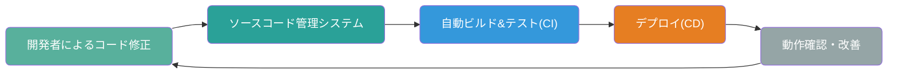
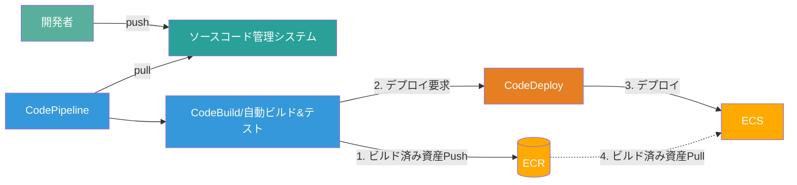
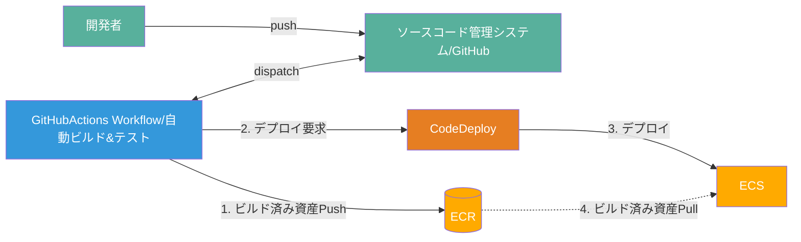
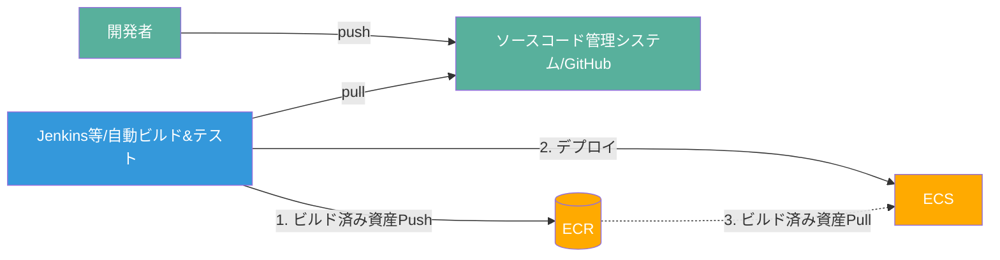

# SpringBoot雛形アプリをCI/CD構成でAWSに構築する手順

## 概要
- ECS Fargateにデプロイ
- CI/CDは以下の2パターンに対応
  - CodePipeline + CodeBuild + CodeDeploy
  - GitHub Actions + CodeDeploy
- AWS各種リソースはCloudFormationで構築

## CI/CDについて
### CI/CD概念図


### ECSでCI/CDを構成する例
#### CodePipeline + CodeBuild + CodeDeploy で実現する場合


#### Github Actions + CodeDeploy で実現する場合


#### 簡易に実現する場合
Blue/Greenデプロイ等の高度なデプロイ戦略が不要な場合はCodeDeployを利用しないパターンもあり


## 構築事前準備

### AWS Codestar Connectionsの接続作成
GitHubからソースコードを取得するための接続を以下より作成  
https://ap-northeast-1.console.aws.amazon.com/codesuite/settings/connections/create?origin=settings&region=ap-northeast-1


### 作業用端末にAWS CLI v2をインストール
https://aws.amazon.com/jp/cli/

### AWS CLI でリソース操作できる十分な権限を持つプロファイル又はクレデンシャルを用意
https://docs.aws.amazon.com/ja_jp/cli/v1/userguide/cli-configure-files.html

---

## 構築手順

### 0. 環境変数設定
前手順で作成したAWS Codestar ConnectionsのARNを指定
```shell
# ex) CODESTART_CONNECTION_ARN=arn:aws:codestar-connections:ap-northeast-1:xxxxxxxx:connection/xxxxxxxx-xxxx-xxxx-xxxx-xxxxxxxx
export CODESTAR_CONNECTION_ARN=
```

環境識別子を指定（`dev` を指定）
```shell
export STAGE=dev
```


### 1. 基本ネットワーク構築
```shell
aws cloudformation deploy \
--stack-name springboot-apps-template-network-$STAGE \
--template-file ./cloudformation/01-create-network.yaml
```

### 2. 基本SecurityGroup作成
```shell
aws cloudformation deploy \
--stack-name springboot-apps-template-securitygroup-$STAGE \
--template-file ./cloudformation/02-securitygroup.yaml 
```

### 3. ALB作成
```shell
# ALB本体
aws cloudformation deploy \
--stack-name springboot-apps-template-alb-$STAGE \
--template-file ./cloudformation/03.01.alb.yaml \
--parameter-overrides AlbNameSuffix=webapps-alb

# TargetGroupとListenerルール
aws cloudformation deploy \
--stack-name springboot-apps-template-alb-tg-$STAGE \
--template-file ./cloudformation/03.02.alb.targetgroup.yaml \
--parameter-overrides ApplicationName=webapp-example \
  AlbNameSuffix=webapps-alb
```

### 4. ECS定義作成
```shell
# 既存のServiceLinkedRoleが存在するか確認
ECS_ROLE_CREATE_OPTION=$(aws iam get-role --role-name "AWSServiceRoleForECS" > /dev/null 2>&1 && echo "CreateServiceLinkedRole=false" || echo "CreateServiceLinkedRole=true")
# ECS用Role等作成
aws cloudformation deploy \
--stack-name springboot-apps-template-ecs-base-$STAGE \
--template-file ./cloudformation/04.01.ecs.task.base.yaml \
--capabilities CAPABILITY_NAMED_IAM \
--parameter-overrides $ECS_ROLE_CREATE_OPTION

# ECSクラスター作成
aws cloudformation deploy \
--stack-name springboot-apps-template-ecs-cluster-$STAGE \
--template-file ./cloudformation/04.02.ecs.cluster.yaml

# ECSタスク定義
aws cloudformation deploy \
--stack-name springboot-apps-template-ecs-task-def-$STAGE \
--template-file ./cloudformation/04.03.ecs.task.def.yaml

# ECSサービス
aws cloudformation deploy \
--stack-name springboot-apps-template-ecs-service-$STAGE \
--template-file ./cloudformation/04.04.ecs.service.yaml
```

### 5. CI/CD定義作成
```shell
# Base
aws cloudformation deploy \
--stack-name springboot-apps-template-ci-base-$STAGE \
--template-file ./cloudformation/05.01.ci.base.yaml \
--capabilities CAPABILITY_NAMED_IAM

# ECR
aws cloudformation deploy \
--stack-name springboot-apps-template-ci-ecr-$STAGE \
--template-file ./cloudformation/05.02.ci.ecr.yaml

# CodeBuild
aws cloudformation deploy \
--stack-name springboot-apps-template-ci-codebuild-$STAGE \
--template-file ./cloudformation/05.03.ci.codebuild.yaml

# CodeDeploy
aws cloudformation deploy \
--stack-name springboot-apps-template-ci-codedeploy-$STAGE \
--template-file ./cloudformation/05.04.ci.codedeploy.yaml \
--parameter-overrides AlbNameSuffix=webapps-alb ApplicationName=webapp-example

# CodePipeline
aws cloudformation deploy \
--stack-name springboot-apps-template-ci-codepipeline-$STAGE \
--template-file ./cloudformation/05.05.ci.codepipeline.yaml \
--parameter-overrides CodeStarConnectionArn=$CODESTAR_CONNECTION_ARN
```


---

## CodePipeline パイプライン実行
注）CloudFormationでCodePipelineを作成したタイミングで自動実行されているため初期構築時は不要

### CLIから実行する場合
```shell
# CodePipeline実行
aws codepipeline start-pipeline-execution --name bootapps-tmpl-$STAGE-webapp-example-pipeline
# 状態確認
aws codepipeline get-pipeline-execution --pipeline-name bootapps-tmpl-$STAGE-webapp-example-pipeline --pipeline-execution-id $(aws codepipeline list-pipeline-executions --pipeline-name bootapps-tmpl-$STAGE-webapp-example-pipeline --max-results 1 | jq -r '.pipelineExecutionSummaries[0].pipelineExecutionId')
```

### マネージドコンソールから実行する場合
https://ap-northeast-1.console.aws.amazon.com/codesuite/codepipeline/pipelines?region=ap-northeast-1
- `変更をリリースする` ボタンでpipeline開始


### 補足
- 以下のエラーによりECSのデプロイが出来ない場合はEC2インスタンスをスペック等何でも良いので1台起動する
  - `You've reached the limit on the number of tasks you can run concurrently.`
  - [参考情報](https://repost.aws/questions/QUiWCpad5jReKxxTiWjKfeyA/how-to-solve-the-ecs-error-youve-reached-the-limit-on-the-number-of-tasks-you-can-run-concurrently)

---

## ECSタスク起動
- 初期タスク数は0のため1以上に更新する
```shell
# webapp-example
aws ecs update-service \
--cluster bootapps-tmpl-$STAGE-cluster \
--service bootapps-tmpl-$STAGE-webapp-example-service \
--desired-count 1 > /dev/null 2>&1
```

---

## 動作確認
### URL確認してアクセス
```shell
# ALBのDNS名を取得
ALB_DNS=$(aws elbv2 describe-load-balancers \
  --names bootapps-tmpl-$STAGE-webapps-alb \
  --query "LoadBalancers[0].DNSName" \
  --output text)

# URL表示
echo "URL: http://$ALB_DNS/"
```


---

### （オプション）Aurora PostgreSQL作成
作成しなくてもサンプルアプリは動く
```shell
aws cloudformation deploy \
--stack-name springboot-apps-template-aurora-$STAGE \
--template-file ./cloudformation/06.01.aurora.yaml
```

